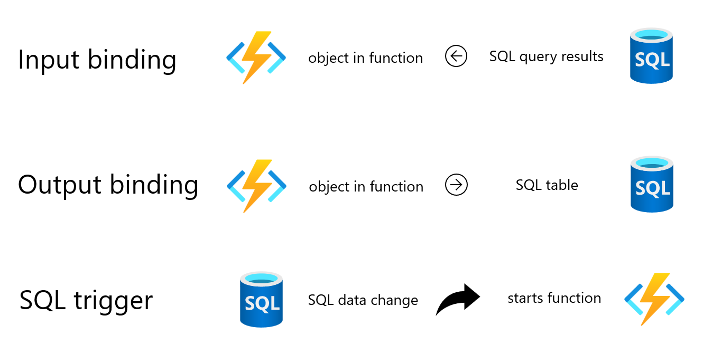
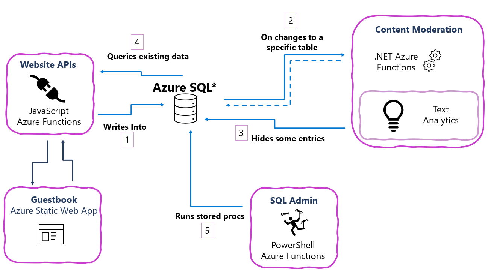

# SQL bindings guestbook demo

A sample application where users can leave a message and view recent messages.  After entry, messages are send to content moderation.

## Components
- Azure SQL Database
- .NET Azure Functions
  - SQL trigger
  - SQL output binding
- JavaScript Azure Functions
  - SQL output binding
  - SQL input binding
- Azure Static Web App
 

## What are SQL bindings?

Learn more at [https://aka.ms/sqlbindings](https://aka.ms/sqlbindings).

- Azure Functions can authenticate to Azure SQL Database with Azure AD Managed Identity
- Configure SQL bindings with a connection string and T-SQL query, stored procedure name, or table name
 
## Architecture

- [JavaScript Azure Functions](apis/js-api/)
  - lists some entries from the app.Entry table (SQL input binding)
  - add guestbook entry for to app.Entry table (SQL output binding)
- [Azure Static Web App](guestbook/)
  - input form for adding guestbook entries
  - list of guestbook entries
  - calls to the JavaScript Azure Functions
- [.NET Azure Function](apis/net-api/)
  - SQL trigger on changes in app.Entry table
  - sends newly inserted rows to Azure Content Moderation
  - SQL output binding writes moderation results to app.Moderation table
  - SQL output binding updates to app.Entry table
- [PowerShell Azure Function](apis/powershell-api/)
  - timer trigger runs the PowerShell functoion on a schedule
  - SQL input binding runs a stored procedure checking the health of change tracking